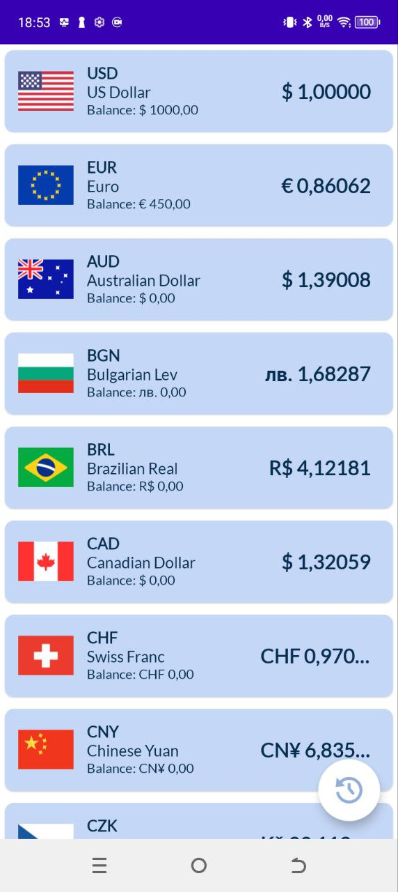
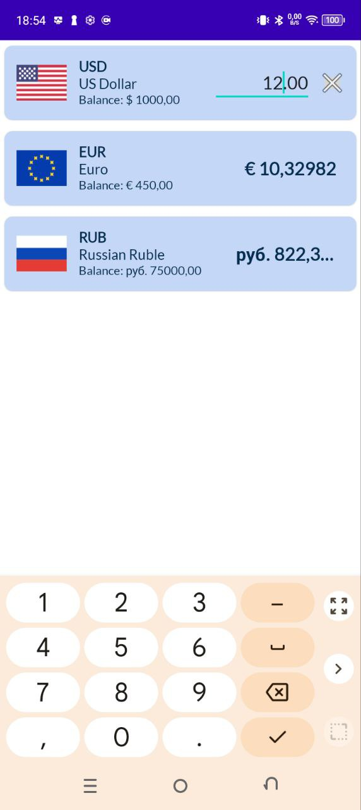
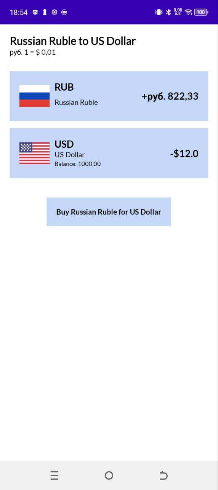
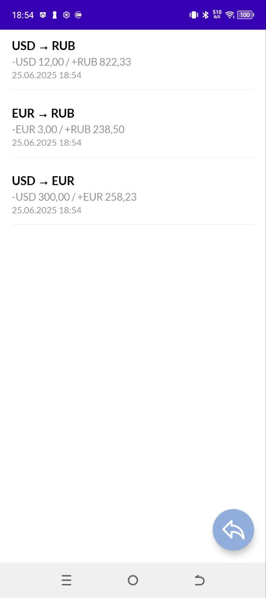

# Currency Converter App

## Описание

Приложение для обмена валют.

- По клику на валюту все остальные валюты пересчитывается по курсу к выбранной
- При клике на сумму валюты при достаточном балансе (больше нуля) происходит переход
на экран совершения транзакции. При вводе суммы список доступных дял транзакций валют 
фильтруется в зависимости от баланса счета, а также автоматически рассчитывается сумма
транзакции
- При клике на покупаемую валюту происходит переход на экран подтверждения транзакции
- На главном экране можно перейти на экран со списком всех совершенных транзакций

## Используемые подходы и технологии

- Room 
- Retrofit (для демонстрации загрузки символов и названий валют вместо использования ресурсов)
- Hilt
- Unit-тесты (частично)
- UI - фрагменты и навигации через Navigation Component
- MVVM и Clean Architecture с разделением на слои

## Настройка ключей API

Для корректной работы приложения необходимо указать URL сервера и ключ API

В корне проекта должен быть файл `local.properties` со следующими параметрами:

   1. CURRENCY_API_URL=https://api.currencyapi.com/v3/
   2. CURRENCY_API_KEY=cur_live_1JyX7FWkzZzlEcQmSaU92mCQQfNyFSnHNgGvVd8b

## Скриншоты

### Главный экран со списком валют и экран ввода суммы

  
  

### Экран подтверждения транзакции и список транзакций

  
  

